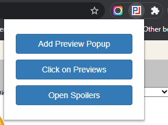
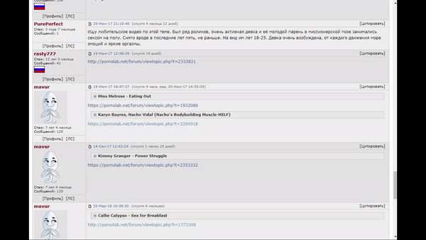
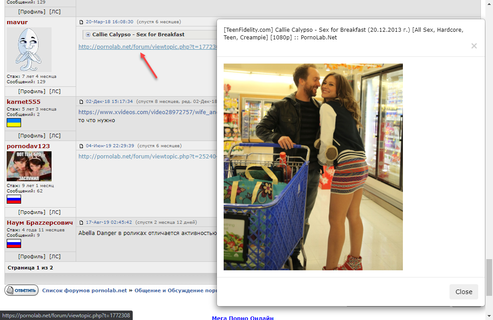

## Pornolab assistant
---



It is a module for Google Chrome webbrowser, that will help you to get more information from porno-tracker pornolab.net in a less time!

## Functionality




At the current moment, plugin can:

* Expand all spoilers in topic
* Open all links to the full screenshots in topic
* Add preview modal: it appears when you focus links, that contains 'pornolab.net'. In modal displays some information, such as poster (first image in a topic), title and so on. Maybe in a future I will add something more


## Helpful information

* How to add plugin to chrome in dev mode (because it is not published in google chrome market yet):

```
If it is ZIP’d, extract the contents somewhere
In Chrome, open chrome://extensions/
Click + Developer mode
Click Load unpacked extension…
Navigate to the extension’s folder and click OK
Delete the (extracted) folder (the extension was copied)
```
