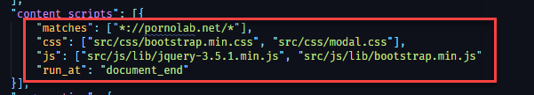

## Pornolab assistant
---


This is a module for the Google Chrome web browser that will help you get more information from the porno-tracker pornolab.net in less time!

## Functionality

# Popup


# Image Column


Currently, the plugin can:

* Expand all spoilers in a topic
* Open all links to the full screenshots in a topic
* Add a preview modal: it appears when you focus on links that contain 'pornolab.net'. The modal displays information such as the poster (first image in a topic), title, and more. Maybe in the future I will add something else
* Add a preview column with the first large image


## Advantages

* *Use it only when you need it!*: There are no hidden background activities that cause performance degradation. All scripts load only for certain sites that match the URL address.



* *Click on a button and only then receive benefits* - our philosophy. No pre-fetches, pre-loads, or background processing. The plugin won't annoy you while visiting the portal.  


* *Open source and small codebase* - easy to read, easy to debug, easy to understand

## Helpful information


* How to add the plugin to Chrome in dev mode (because it is not published in the Google Chrome Web Store yet):

```bash
If it is ZIP’d, extract the contents somewhere.
In Chrome, open chrome://extensions/
Click "Developer mode"
Click "Load unpacked extension…"
Navigate to the extension’s folder and click OK.
You can delete the (extracted) folder after loading (the extension was copied).
```
